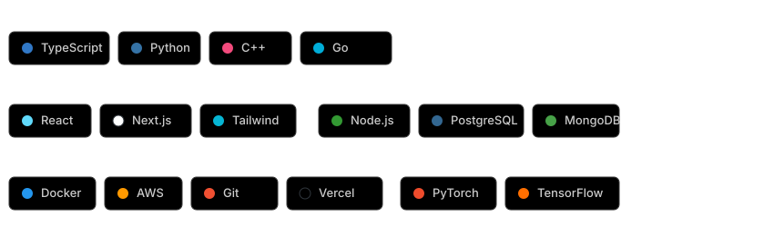

<video src="https://github.com/NetPranav/NetPranav/raw/main/assets/hero.mp4" width="800" controls autoplay loop muted></video>

---

 

  <h3>Current Focus</h3>
  

 

---

 

  <h3>Featured Projects</h3>
  

 

---

 

  <h3>Current Status</h3>
  

 

---

 

  <h3>Tech Stack</h3>
  

 

---

 

  <h3>Activity & Contributions</h3>
   
  
    
  
    
  <!-- GitHub Activity Graph Snake -->
  <!-- Note: We can add the snake animation here once the action runs to generate it. -->

 

---

  

    <a href="https://linkedin.com/in/NetPranav" target="_blank">LinkedIn</a> • 
    <a href="mailto:contact@netpranav.com">Email</a> • 
    <a href="https://github.com/NetPranav" target="_blank">GitHub</a>
  

