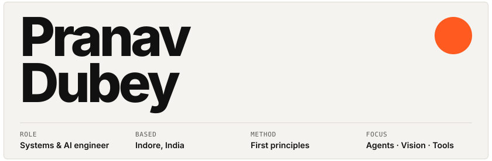
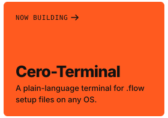
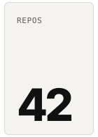
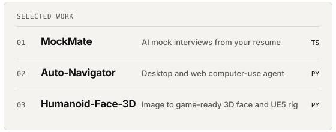
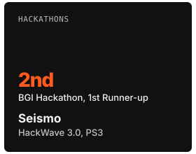
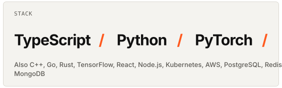
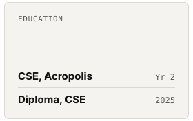

<a href="https://github.com/NetPranav"><picture><source media="(prefers-color-scheme: dark)" srcset="./generated/bento/hero-dark.svg"></picture></a> 
<a href="https://github.com/NetPranav/Cero-Terminal"><picture><source media="(prefers-color-scheme: dark)" srcset="./generated/bento/now-dark.svg"></picture></a><a href="https://github.com/NetPranav?tab=repositories"><picture><source media="(prefers-color-scheme: dark)" srcset="./generated/bento/repos-dark.svg"></picture></a><a href="https://github.com/NetPranav?tab=repositories"><picture><source media="(prefers-color-scheme: dark)" srcset="./generated/bento/languages-dark.svg"></picture></a> 
<a href="https://github.com/NetPranav?tab=repositories"><picture><source media="(prefers-color-scheme: dark)" srcset="./generated/bento/work-dark.svg"></picture></a><a href="https://github.com/NetPranav/BGI-Hackathon"><picture><source media="(prefers-color-scheme: dark)" srcset="./generated/bento/hackathons-dark.svg"></picture></a> 
<a href="https://github.com/NetPranav"><picture><source media="(prefers-color-scheme: dark)" srcset="./generated/bento/stack-dark.svg"></picture></a><a href="https://github.com/NetPranav"><picture><source media="(prefers-color-scheme: dark)" srcset="./generated/bento/education-dark.svg"></picture></a> 
<a href="https://github.com/NetPranav"><picture><source media="(prefers-color-scheme: dark)" srcset="./generated/bento/contact-dark.svg"></picture></a>

